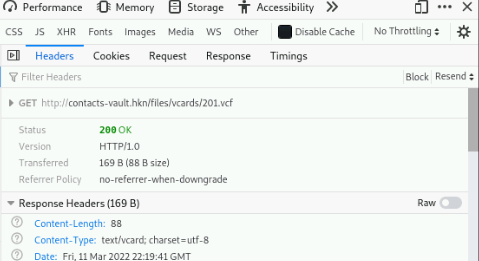

# House Of Vcards Writeup

## Challenge information
Navn: House Of Vcards

Forslået Sværhedsgrad: Let

Haaukins API: Ja

Beskrivelse: 

Jeg har lavet en ny smart side, så folk kan holde styr på alle deres kontakter, men jeg er lidt nervøs for at have så meget personfølsom data liggende.

Kan du tjekke siden igennem og se, hvad du kan få adgang til?

http://contacts-vault.hkn

## Writeup

Vi kan tilgå http://contacts-vault.hkn og finder forsiden til hvad ligner en kontaktbog:


Ved at trykke på knappen ```Join Contact``` kan vil lave en ny bruger.

Vi er derefter mødt med denne side:


Ved at trykke ```New``` i øverst højre hjørne kan vi oprette en kontakt:


Efter en kontakt er lavet popper den op i vores dashboard, hvor vi enten kan downloade et såkaldt "Vcard" til den. Redigere kontakten eller slette den.

Hvis vi kigger på netværkstrafikken via. browser konsollen når vi trykker på Vcard knappen kan vi se den laver en request til ```http://contacts-vault.hkn/files/vcards/201.vcf```



Hvis vi laver en request til feks. ```http://contacts-vault.hkn/files/vcards/200.vcf``` får vi et Vcard med data i, som vi ikke normalt burde have adgang til:


Det ligner derved at vores flag vil ligge i en af disse kontakter.

Vi kan herfra enten downloade hver kontakt og tjekke om der er et flag i filen. Eller vi kan lave et script som leder efter dette for os.

Jeg valgte at skrive følgende lille script som går igennem .vcf filerne fra 1 til 200:

```python
import requests

url = "http://contacts-vault.hkn/files/vcards/"
ext = ".vcf"

for i in range(0,200):
    r = requests.get(f"{url}{str(i)}{ext}")

    if "DDC" in r.text:
        print(r.text)
```

Dette giver os flaget flere gange:


```DDC{b3tt3r_f1x_th4t_IDOR_vuln_b3f0r3_n3xt_GDPR_4ud1t}```

