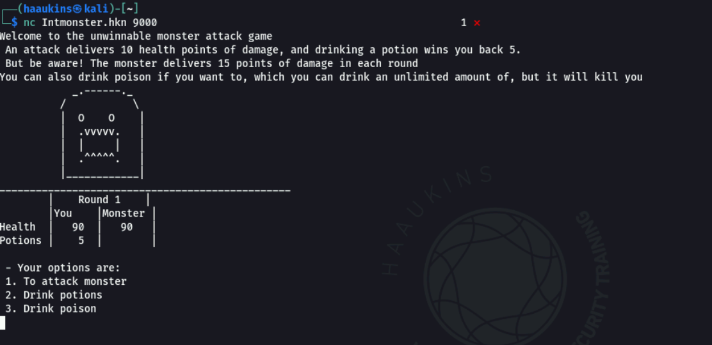
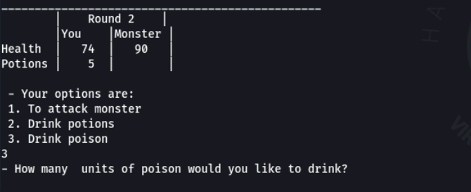
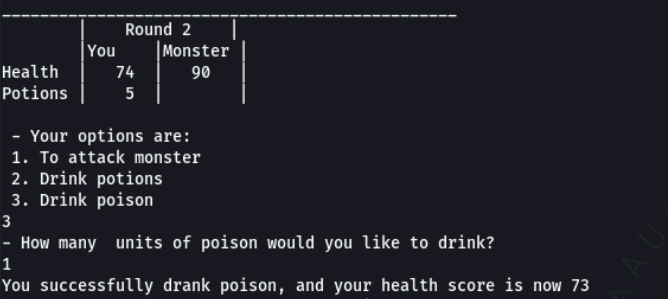
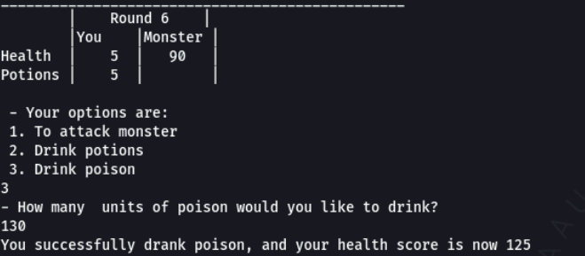
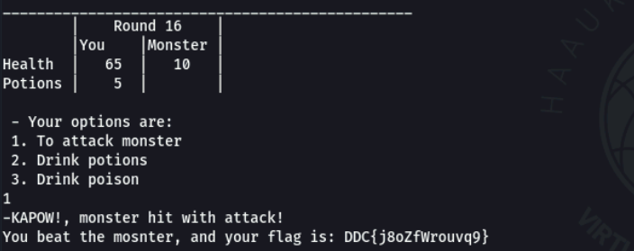

# Password Checker Writeup

## Challenge information

Forslået sværhedsgrad: Let

Haaukins API: Ja

Beskrivelse: 
For at komme forbi denne udfordring du skal tilgå et spil på

```nc Intmonster.hkn 9000```

I dette spil skal du besejre monsteret, der vogter flaget.

Spillet går fremad i runder, hvor du kan lave et træk og monsteret angriber dig.

Både du og monsteret starter spillet med 90 livs point.

For hver runde af spillet kan du enten:

    
    Angribe monsteret
    
    Drikke eliksirer (du har 5)
    
    Drikke gift


Den sidste mulighed er lidt fjollet, der er ingen god grund til at ville forgifte dig selv, du kan kun reducere din egen livs point på den måde.

## Writeup

Vi kan netcatte til Intmonster.hkn og spille spillet:



Spillet er umiddelbart umuligt at vinde, da vi ikke har nok healing potions til at holde os i live og slå monsteret ihjel samtidigt.

En ting der dog er interessant er vi kan vælge hvor mange poison potions vi vil drikke hver gang:



Hver poison potion skader os 1



Ved at drikke nok poison potions kan vi få værdien til at rulle over til at blive positiv.:



Dette er sikkert forårsaget af at vores livspoint er gemt i en signed char (en værdi mellem -128 og 127).

Dvs. når vi giver en værdi på over 128 (feks 130), ruller værdien over til positiv, og derved får vi livspoint istedet.

Ved brug af dette kan vi derved slå monsteret ihjel og få flaget:



Flag:
```
DDC{j8oZfWrouvq9}
```
