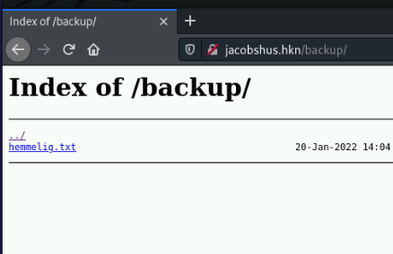
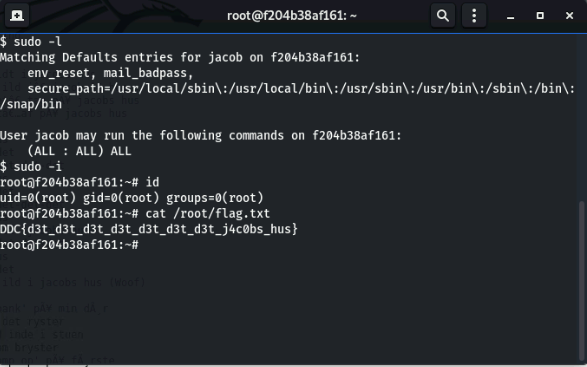

# Jacobs Hus Writeup

## Challenge information
Navn: Jacobs Hus

Forslået Sværhedsgrad: Meget Let

Haaukins API: Ja

Beskrivelse: det det det det, det det det det det jacobs hus: http://jacobshus.hkn

## Write-up
Hvis vi tilgår http://jacobshus.hkn via. browseren ser vi følgende:


```ingen robotter tak``` er et hint til at kigge i filen robots.txt.
robots.txt bliver for det meste brugt af webserver ejere til at fortælle web crawlers, hvilke sider på websitet de ikke må indeksere.

robots.txt:
```
User-agent: *
Disallow: /backup
```

Vi kan derved se at de ikke er vilde med en web crawler (en robot) tilgår siden /backup og indekserer den. Lad os tage et kig i /backup:




Vi får en indeksering af folderen og kan se der er en enkelt fil der hedder hemmelig.txt.


Teksten i denne er vild lang, men det vigtigste er det første der bliver nævnt i filen:
```
husk nu din kode til husets indgang!

koden er: 'kodeord'

og du kommer ind med ssh
HEHEHEHHEHEHEHEHHEHEHEH
```

Vi kan derved ssh ind på serveren med brugernavn ```jacob``` og password ```kodeord```:


Hvis vi kører 
```sudo -l``` og indtaster vores kodeord fra tidligere, kan vi se vi har fulde sudo rettigheder og kan derved elevere os til root vha. ```sudo -i```. Derefter kan vi printe flaget ud i /root/flag.txt:



Derved har vi fået flaget!
```DDC{d3t_d3t_d3t_d3t_d3t_d3t_d3t_j4c0bs_hus}```

