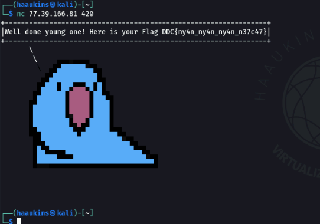

# Nyan The Netcat Writeup

## Challenge information

Forslået sværhedsgrad: Let

Haaukins API: Ja

Beskrivelse:
Scan netværket se, hvad du finder.

Men pas på!

Net-katte og festpapegøjer lurer måske!

## Writeup
Jeg valgte at skanne det interne netværk til at starte med, med arp-scan. Da dette hurtigt kan give mig et overblik over hvilke instanser jeg har lyst til at skanne:

```bash
└─$ sudo arp-scan 77.39.166.0/24                                            1 ⨯
Interface: eth0, type: EN10MB, MAC: 08:00:27:28:37:08, IPv4: 77.39.166.4
Starting arp-scan 1.9.7 with 256 hosts (https://github.com/royhills/arp-scan)
77.39.166.2	02:42:4d:27:a6:02	(Unknown: locally administered)
77.39.166.3	02:42:4d:27:a6:03	(Unknown: locally administered)
77.39.166.34	02:42:4d:27:a6:22	(Unknown: locally administered)
77.39.166.41	02:42:4d:27:a6:29	(Unknown: locally administered)
77.39.166.65	02:42:4d:27:a6:41	(Unknown: locally administered)
77.39.166.81	02:42:4d:27:a6:51	(Unknown: locally administered)

6 packets received by filter, 0 packets dropped by kernel
Ending arp-scan 1.9.7: 256 hosts scanned in 1.995 seconds (128.32 hosts/sec). 6 responded
```

77.39.166.2 og 77.39.166.3 ligner nogle IP'er der står for noget administrativt. Jeg valgte derved at lade disse 2 ligge, til hvis jeg fik brug for det.

Dvs. vores skan IP liste ser ud som følgende nu:

```
77.39.166.34
77.39.166.41
77.39.166.65
77.39.166.81
```

Siden challenge hedder "Nyan the netcat" har jeg på fornemmelsen der kører en netcat session på en af portene, på flere af disse instanser. At skanne disse 4 IP adresser med fuld versionsskan mm., vil derved tage en evighed. Istedet kan vi lave en TCP syn scan, som istedet sender en SYN pakke afsted til en port. Hvis porten sender en SYN-ACK tilbage, antages porten for at være åben:

```bash
┌──(haaukins㉿kali)-[~]
└─$ sudo nmap -sS 77.39.166.34 77.39.166.41 77.39.166.65 77.39.166.81 -p1-65535                                                     1 ⨯
Starting Nmap 7.91 ( https://nmap.org ) at 2022-03-19 06:43 EDT
Nmap scan report for 77.39.166.34
Host is up (0.000092s latency).
Not shown: 65534 closed ports
PORT     STATE SERVICE
4242/tcp open  vrml-multi-use
MAC Address: 02:42:4D:27:A6:22 (Unknown)

Nmap scan report for 77.39.166.41
Host is up (0.000064s latency).
Not shown: 65534 closed ports
PORT     STATE SERVICE
4444/tcp open  krb524
MAC Address: 02:42:4D:27:A6:29 (Unknown)

Nmap scan report for 77.39.166.65
Host is up (0.000055s latency).
Not shown: 65534 closed ports
PORT     STATE SERVICE
6969/tcp open  acmsoda
MAC Address: 02:42:4D:27:A6:41 (Unknown)

Nmap scan report for 77.39.166.81
Host is up (0.00010s latency).
Not shown: 65534 closed ports
PORT    STATE SERVICE
420/tcp open  smpte
MAC Address: 02:42:4D:27:A6:51 (Unknown)

Nmap done: 4 IP addresses (4 hosts up) scanned in 7.99 seconds
```

Derefter kan vi nc til hver af dem for at tjekke hvad der kører på nc sessionen.

```bash
nc <IP> <PORT>
```

En Nyan cat, er forkert og giver ikke et flag:


Til gengæld er papegøjen ret sej og giver et flag:



```
DDC{ny4n_ny4n_ny4n_n37c47}
```


