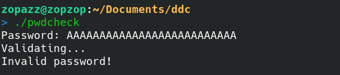

# Password Checker Writeup

## Challenge information

Forslået sværhedsgrad: Let

Haaukins API: Nej

Beskrivelse: 
Jeg har sikret mit program med et password, så kun jeg kan bruge det!

Kan du gætte mit password og skaffe dig adgang? 

Filer med i download:
pwdcheck (Kan findes i denne folder)

## Writeup

Vi modtager en binary der hedder "pwdcheck". Når vi kører binarien spørger den om et password, som vi skal finde for at løse denne challenge:



Vi er derved nødt til at reverse engineer applikationen for at finde passwordet.

Decompilation af denne applikation er rigtig pæn. Sådan her ser main funktionen ud:


Her kan vi se den kører check_password på vores input. Lad os tage et kig på den funktion:


Som der kan ses her tager den vores password og sammenligner det med hver karakter der findes i masked - 66.

Vi kan derved tage værdierne i masked og skrive et script der emulerer denne funktionalitet:

Her er værdierne i i masked:
```
86 86 85 BD AF 76 B5 AD  73 B0 A9 A1 AF BB A1 B2
76 B5 B5 B9 72 B4 A6 A1  77 AA 72 B7 AE A6 A1 A4
75 A1 A9 72 72 A6 A1 75  B0 72 B7 A9 AA A1 B4 73
A9 AA B6 81 BF
```
script der tager hver karakter og trækker 66 fra det:

```python
from Crypto.Util.number import long_to_bytes

maskedbytes = long_to_bytes(int("868685BDAF76B5AD73B0A9A1AFBBA1B276B5B5B972B4A6A177AA72B7AEA6A1A475A1A97272A6A175B072B7A9AAA1B473A9AAB681BF",16))

for byte in maskedbytes:
    print(chr(byte-66),end="")
```

Dette giver os flaget:

```
DDC{m4sk1ng_my_p4ssw0rd_5h0uld_b3_g00d_3n0ugh_r1ght?}
```
