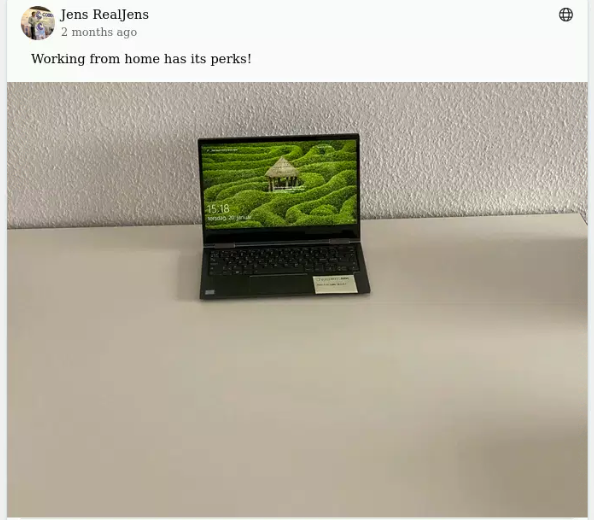
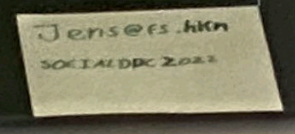
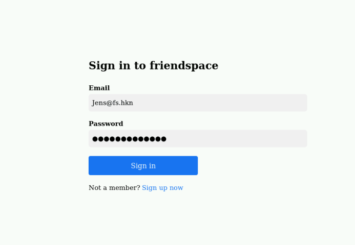
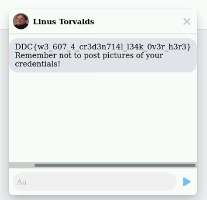

# Rona AKA ... Writeup

## Challenge information

Forslået sværhedsgrad: Meget Let

Haaukins API: Ja

Beskrivelse:
Gå til http://friendspace.hkn

Rona aka SARS-CoV-2 aka COVID19 har gjort vores hjemme arbejdsplads meget interessante!

OBS: Udfordringerne Rona aka .. og The Artist kan løses på samme API instans

## Writeup

Efter at have oprettet en konto på http://friendspace.hkn kan vi scrolle i vores feed.

Vi vil derved se at en "Jens RealJens" har lagt et billede op af deres hjemmearbejdsplads. Med en postit note på siden af hans laptop



Ved at højreklikke og trykke "View Image" kan vi få en større version og læse hvad der står på noten:



Vi kan derefter prøve at logge ind som ham med

Brugernavn: Jens@fs.hkn
Passowrd: SOCIALDDC2022



Dette giver os adgang til hans konto. 

Hvis vi kigger i hans beskeder finder vi et flag:



```
DDC{w3_607_4_cr3d3n714l_l34k_0v3r_h3r3}
```
