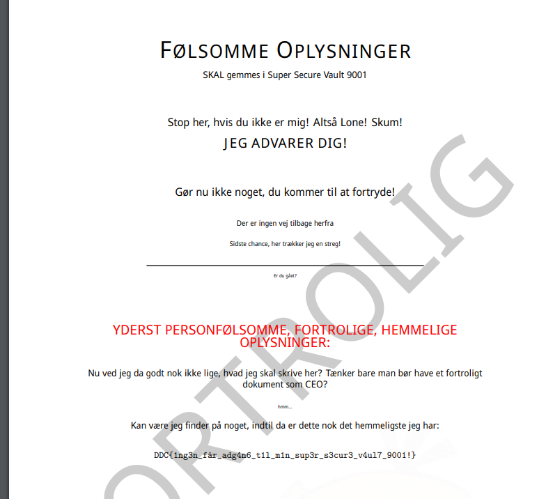

# Meta Writeup

## Challenge information

Forslået sværhedsgrad: Meget Let

Haaukins API: Nej

Beskrivelse:
Vi har modtaget en alarm fra vores monitoring system og har brug for, du kigger vores netværkslogs igennem.

Alarmen blev sendt fra vores "Super Secure Vault 9001" system, hvor jeg opbevarer alle mine topfortrolige dokumenter.

Sandsynligheden for et reelt breach på et så sikkert system er naturligvis mikroskopisk, men hvis du alligevel finder noget, rapporterer du selvfølgelig direkte tilbage til mig UDEN selv at snuse mere rundt!

-- Lone Skum, CEO ClosedML 

Filer i download:
vault.pcapng

## Writeup
Ved at kigge på pcappen i Wireshark kan det hurtigt ses at en hacker har tilgået og downloadet filer fra hjemmesiden.

Det ligner de derefter har exfiltreret følsom data. Alt den følsomme data er exfiltreret ukryptere og er derved i pcap filen.

Vi kan bruge binwalk til at extracte data ud af filen og finde offsets:

```bash
> binwalk vault.pcapng --dd=".*"

DECIMAL       HEXADECIMAL     DESCRIPTION
--------------------------------------------------------------------------------
1745          0x6D1           HTML document header
3161          0xC59           HTML document footer
5077          0x13D5          HTML document header
6493          0x195D          HTML document footer
8409          0x20D9          HTML document header
9825          0x2661          HTML document footer
13543         0x34E7          HTML document header
13908         0x3654          HTML document footer
15963         0x3E5B          HTML document header
16381         0x3FFD          HTML document footer
18447         0x480F          HTML document header
18865         0x49B1          HTML document footer
20935         0x51C7          HTML document header
21353         0x5369          HTML document footer
23411         0x5B73          HTML document header
23829         0x5D15          HTML document footer
25907         0x6533          HTML document header
26325         0x66D5          HTML document footer
28395         0x6EEB          HTML document header
28813         0x708D          HTML document footer
30879         0x789F          HTML document header
31297         0x7A41          HTML document footer
33217         0x81C1          HTML document header
34633         0x8749          HTML document footer
38796         0x978C          HTML document header
39302         0x9986          HTML document footer
41219         0xA103          HTML document header
41584         0xA270          HTML document footer
43835         0xAB3B          HTML document header
44200         0xACA8          HTML document footer
46263         0xB4B7          HTML document header
47162         0xB83A          HTML document footer
49086         0xBFBE          JPEG image data, JFIF standard 1.01
74482         0x122F2         PDF document, version: "1.5"
74558         0x1233E         Zlib compressed data, best compression
76034         0x12902         Zlib compressed data, best compression
96691         0x179B3         Zlib compressed data, best compression
117195        0x1C9CB         Zlib compressed data, best compression
130662        0x1FE66         Zlib compressed data, best compression
131589        0x20205         Zlib compressed data, best compression
137187        0x217E3         HTML document header
137552        0x21950         HTML document footer
```

Her ser jeg umiddelbart 2 filer der er interessante et billede og en PDF fil.

Med dd kommandoen med binwalk er offsets set ovenfor blevet extracted og lagt i folder _vault.pcapng.extracted.

Derinde fra kan vi åbne og kigge på PDF filen:



Og derved har vi fået flag:

```
DDC{1ng3n_får_adg4n6_t1l_m1n_sup3r_s3cur3_v4ul7_9001}
```


